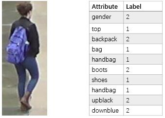

# Duke_Attribute

## About dataset
We annotate 23 attributes for [Duke](https://github.com/layumi/Duke_evaluation), 
which  is a subset of the [DukeMTMC](http://vision.cs.duke.edu/DukeMTMC/). 
The original dataset contains 702 identities for training and 1110 identities for testing. 
The attributes are annotated in the identity level, 
thus the file contains 23 x 702 attributes for training and 23 x 1110 for test.

The 23 attributes are: 

| attribute | representation in file | label |
| :----: | :----: | :----: |
| gender | gender | male(1), female(2) |
| length of upper-body clothing | top | short upper body clothing(1), long(2)    |
| wearing boots| boots| no(1), yes(2)    |
| wearing hat| hat | no(1), yes(2) |
| carrying backpack| backpack | no(1), yes(2) |
| carrying bag| bag | no(1), yes(2) |
| carrying handbag| handbag | no(1), yes(2) |
| color of shoes| shoes | dark(1), light(2) |
| 8 color of upper-body clothing| upblack, upwhite, upred, uppurple, upgray, upblue, upgreen, upbrown | no(1), yes(2) |
| 7 color of lower-body clothing| downblack, downwhite, downred, downgray, downblue, downgreen, downbrown | no(1), yes(2) |

## Sample



## Cite

If you use this dataset in your research, please kindly cite our work as,
```
@article{lin2017improving,
  title={Improving Person Re-identification by Attribute and Identity Learning},
  author={lin, Yutian and Zheng, Liang and Zheng, Zhedong and, Wu Yu and, Yang, Yi},
  journal={arXiv preprint arXiv:1703.07220},
  year={2017}
}
```

## Acknowledgement

We thank Dr. Gao for annotating part of the dataset.
